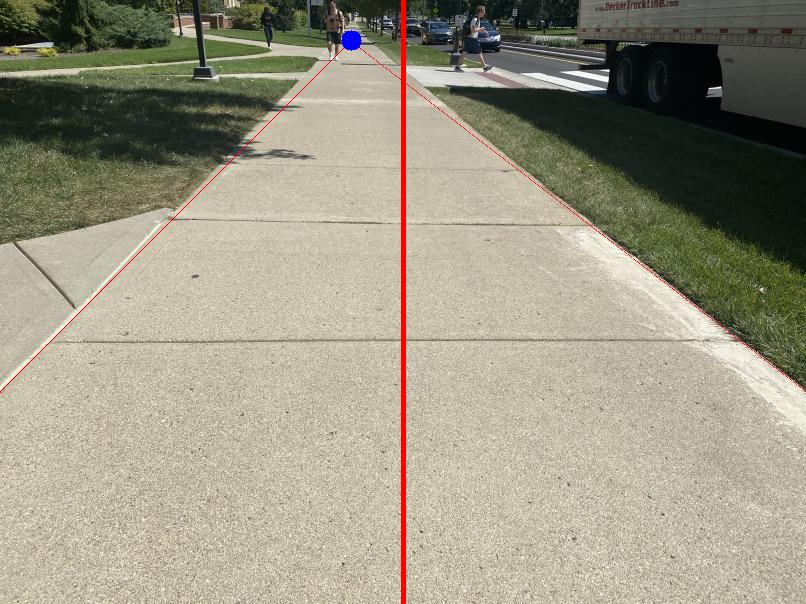
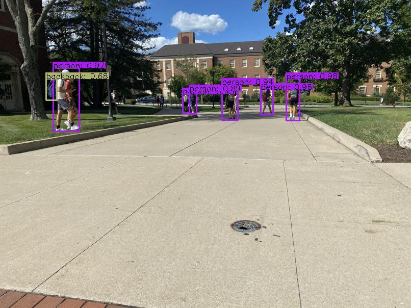

# Output of RobotVision

## 1. Edge Detection for Sidewalk Navigation and Adjustment

   

## 2. Object Detection for Collision Avoidance.

   

### _For YoloV4 model:_
  - OpenCV does not support GPU, it will be slow for video process without GPU.
    - Solution: use YoloV4 via Pytorch/Tensorflow
  - Download YoloV4 model's weights and put it inside 'models/' folder
    - Link: https://drive.google.com/file/d/18K_4CKzuNmB4GoQXBt6GRpMZlNYASwHk/view?usp=sharing 

